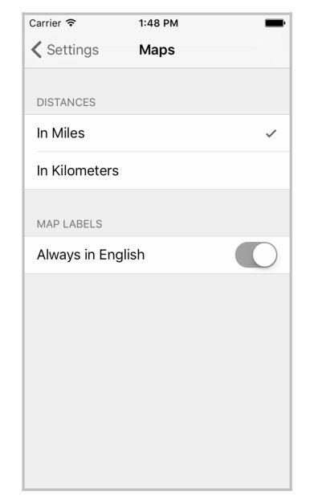
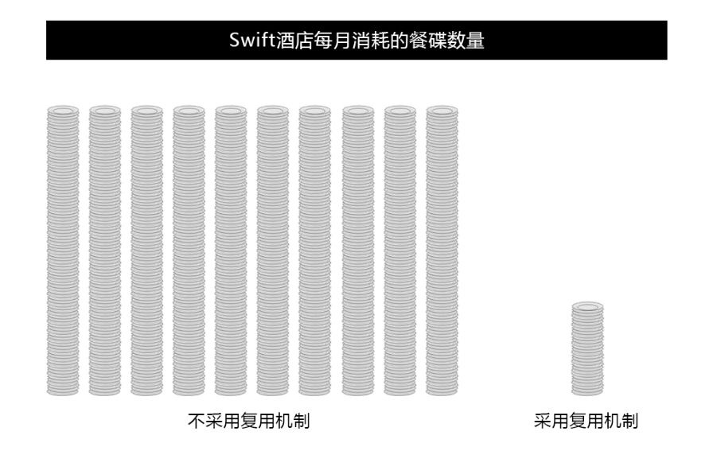
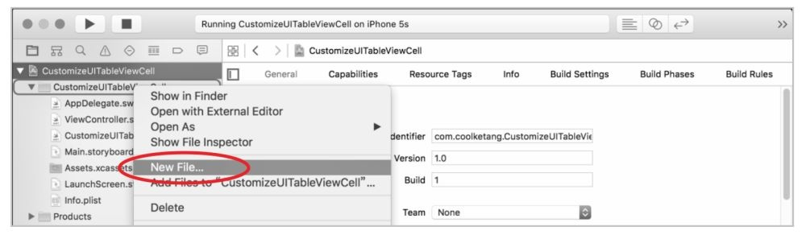

# 第08章　UITableView和UICollectionView  

UITableView是在iOS开发中使用极为广泛的控件，绝大部分iOS应用中都能看到它的身影，同时它也是具备非常多知识点的控件。  

作为UIKit里面最复杂的一个控件，使用起来虽然不难，但是要用好并不容易。当使用UITableView的时候，开发者需要考虑到tableViewCell的设计和重用、tableView数据内容的设计，以及tableView的效率等问题。  

本章主要介绍如何使用UITableView和UICollectionView进行大数据量的显示，并分析和比较两者之间的相似性和差异点。
                 
## 8.1  UITableView概述 187       

UITableView用于在一栏内显示一系列对象，它是UIScorllView的子类。大家知道，UIScrollView可以在任意方向上滑动内容，而UITableView仅支持在垂直方向上的滑动。UITableView由单元格UITableViewCell组成，UITableView中的内容都是由UITableViewCell负责显示的。  

UITableView在应用程序中可用于：  

- 方便用户浏览具有层次结构的数据（如图8.1所示）。
- 提供一个可供选择的列表（如图8.2所示）。
- 显示一系列数据的索引列表（如图8.3所示）。
- 利用分组结构，展示细节信息和更详细的设置（如图8.4所示）。  

<center>图8.1</center>  
  
图8.2  
  
图8.3  
  
图8.4    


<div align="center">


</div>

尽管4张示例图片的外观不同，但是它们都是使用UITableView展示数据的。                            

### 8.1.1　UITableViewCell单元格  
UITableView由UITableViewCell组成，在UITableView中，由UITableViewCell负责数据的显示，UITableView的每一行，即每一个UITableViewCell显示一条项目。UITableView的行数，即UITableViewCell对象的数量不受限制，仅由设备的内存决定。  
UITableView和UITableViewCell之间的关系如图8.5所示。  
UITableViewCell类定义了单元格在UITableView中的属性和行为。  
可以对单元格做如下操作：
●自定义单元格的文字标题、图标、背景等属性。
●对单元格进行选择和高亮操作。
●配置单元格的附加视图。
●对单元格进行添加、删除、改变位置等操作。  

图8.5  
当创建一个单元格时，你可以自定义一个单元格，或者使用系统预定义的几种单元格格式。系统预定义的单元格样式，包含固定样式的标
签、图标等对象。  
使用预定义的单元格，只需为标签和图标提供对应的文字内容和图像内容即可。可以使用textLabel和detailTextLabel属性来设置单元格的文
字内容，使用imageView属性来设置单元格的图标。  
单元格的预定义样式如表8-1所示。  

表8-1　单元格样式枚举类型  
  
图8.6  
  
图8.7  
  
图8.8  
  
图8.9  
  
图8.10  
### 8.1.2　创建一个简单的表格
在这一节中，我们制作一个最简单的表格，该表格将拥有20行单元格。   
通过创建该简单表格，读者将接触到以下知识点：  
- UITableView表格的初始化。  
- 设置UITableView表格的数据源。  
- 设置UITableView表格的行数。  
- 自定义UITableViewCell单元格的样式和内容。  
本实例的最终效果如图8.10所示。  
```swift
1 import UIKit
2
3 class ViewController：UIViewController,
UITableViewDataSource {
4
5 override func viewDidLoad() {
6 super.viewDidLoad()
7 // Do any additional setup after loading the view,
typically from a nib.
8
9 let screenRect = UIScreen.main.bounds
10 let tableRect = CGRect(x：0, y：20, width：
screenRect.size.width, height：screenRect.size.height - 20)
11 let tableView = UITableView(frame：tableRect)
12
13 tableView.dataSource = self
14
15 self.view.addSubview(tableView)
16 }
17
18 func tableView(_ tableView：UITableView,
numberOfRowsInSection section：Int) -> Int{
19 return 20
20 }
21
22 func tableView(_ tableView：UITableView,
cellForRowAt indexPath：IndexPath) -> UITableViewCell {
23
24 let identifier = “reusedCell”
25 var cell =
tableView.dequeueReusableCell(withIdentifier：identifier)
26
27 if(cell == nil)
28 {
29 cell = UITableViewCell(style：
UITableViewCellStyle.default, reuseIdentifier：identifier)
30 }
31
32 cell？.textLabel？.text = “命运负责洗牌，玩牌的是我们
自己！”
33
34 return cell！
35 }
36
37 override func didReceiveMemoryWarning() {
38 super.didReceiveMemoryWarning()
39 // Dispose of any resources that can be recreated.
40 }
41 }
```
在第3行代码中，给视图控制器类添加了一个UITableViewDataSource协议，主要用来给UITableView表格提供数据来源，并用来处理数据源的变化。  其主要代理方法如表8-2所示。  
  
表8-2　UITableViewDatasource主要的代理方法  
在第9～11行代码中，首先获得当前设备的屏幕尺寸，接着初始化了一个UITableView对象，并设置UITableView对象的位置和尺寸，其位置位于顶部状态栏的下方。  
在第13行的代码中，设置UITableView对象的数据源为当前的视图控制器对象，即由当前的视图控制对象，实现数据源协议中定义的各种代理方法。  
在第18～20行的代码中，实现了tableView(_：numberOfRowsInSection：)代理方法，并设置方法的返回值为20。  由于表格默认拥有一个章节，所以在此设置了默认章节具有20行数据。  
在第22～35行的代码中，实现了tableView(_：cellForRowAtIndexPath：)方法，用来初始化和复用单元格。  每当表格对象需要绘制一个单元格时，都会调用该方法。  
该方法的参数及其说明如表8-3所示。  
  
表8-3　cellForRowAtIndexPath方法的参数列表  
在继续讲解后面代码之前，首先来了解下UITableView的复用机制。  复用机制无处不在，即使是在现实生活中，你也可以看到它的身影。  
如图8.12所示，左侧显示的是Swift酒店在不采用复用机制的情况下，每个月所消耗的餐碟数量。  由于采用用完即扔的方式，Swift酒店每个月都要花费一笔不菲的费用，来采购大量的餐碟。  后来酒店采用了更先进的复用机制，当餐碟被顾客使用完毕，并洗涮和消毒之后，再提供给下一批顾客使用，这样大大降低了在餐碟上面的采购费用。  
  
图8.11  
  
图8.12  
在游戏开发过程中，也经常采用复用机制，来降低内存的消耗。  如图8.13所示，在一款战机类的游戏中，需要用到大量的子弹对象。  
如果每发射一枚子弹，就创建一个子弹对象，这样就会消耗大量的内存，而在移动设备中，内存是很稀缺、宝贵的资源。  同时，由于每次开辟内存创建新的对象都会花费一定的时间，这样也会产生卡顿现象。  
复用机制就可以完美解决这些问题。  在游戏开始前，首先创建一定数量的子弹对象，每当一枚子弹被发射并且飞至屏幕之外，或者撞击到敌机消失后，不采用立即销毁子弹对象的方式，而是将消失的子弹恢复其默认属性，留待下次发射时使用。  
UITableView采用相同的复用机制，一个UITableView对象可能拥有超过一百行数据，但是由于受移动设备屏幕尺寸的限制，一次只能显示9行数据，如图8.14左图所示。  当手指在UITableView对象中上下滑动时，最多可以显示10行数据，如图8.14中的右图所示。  
  
图8.13  
  
图8.14  
所以系统只需要创建10个单元格UITableViewCell对象即可。  当手指从下往上滑动时，回收处于屏幕之外的最上方的单元格，并放置在表格的最下方，作为将要显示的第11个单元格。  当UITableView对象从上往下滑动时，也是同样的复用机制。  
了解了UITableView的复用机制后，我们再继续讲解示例中的代码。  
在第24行代码中，定义了一个字符串常量，作为单元格的类型。  你可以给表格添加多种类型的单元格，例如奇数行的单元格，作为标题类型，用来显示文章的标题；偶数行的单元格，作为另一种类型的单元格，负责显示文章摘要，以及阅读数、点赞数、分享数等内容。  
```swift
24 let identifier = “reusedCell”
```
在第25行的代码中，调用表格对象的dequeueReusableCellWithIdentifier方法，从单元格对象池中获取指定类型的、并且可以重复使用的单元格。  
```swift
25 var cell = tableView.dequeueReusableCell(withIdentifier：identifier)
```
如果从对象池中获得的可复用单元格为nil，则调用第27～30行的代码，从内存中创建一个新的单元格UITableViewCell对象。  
```swift
27 if(cell == nil)
28 {
29 cell = UITableViewCell(style：
UITableViewCellStyle.default, reuseIdentifier：identifier)
30 }
```
其中初始化UITableViewCell对象的方法init(style style：UITableViewCellStyle,reuseIdentifier reuseIdentifier：String？)，其参数说明如表8-4所示。  
  
表8-4　UITableViewCell初始化方法的参数列表  
通过第24～30行代码，获得了可以使用的UITableViewCell对象。  接着我们需要设置UITableViewCell对象显示的文字。  
在第32行的代码中，通过UITableViewCell对象的UILabel属性，设置单元格的文字内容。  
```swift
32 cell？.textLabel？.text = “命运负责洗牌，玩牌的是我们自己！”
```   
在第34行的代码中，返回获得并配置好的UITableViewCel对象。  
```swift
34 return cell！
``` 
最后点击Xcode界面左上角的【编译并运行】按钮，打开模拟器运行项目。  最终效果如图8.10所示。  
### 8.1.3　自定义单元格UITableViewCell  
在上一节中，我们创建了一个简单的UITableView对象，该对象中的单元格继承自默认的UITableViewCell类。  在实际工作中，我们常常需要使用自定义的UITableViewCell，来创建更加复杂的单元格对象，以符合业务需求。  
本节将演示如何创建并使用自定义的UITableViewCell类。  
首先创建一个新的Swift项目，然后在项目文件夹上单击鼠标右键，选择【New File……】命令，创建一个Swift类文件，如图8.15所示。  
  
图8.15
接着在弹出的文件选项设置窗口中，配置Swift类文件。  具体的设置如图8.16所示。  
  
图8.16
输入完Swift的类名和父类名之前，点击【Next】按钮进行下一步，然后保持默认的文件存储位置，接着点击【Create】按钮完成Swift文件的创建。  CustomizeUITableViewCell.swift文件创建成功后，打开该文件并输入以下代码：  
```swift
1 import UIKit
2
3 class CustomizeUITableViewCell：UITableViewCell {
4
5 var thumbnail：UIImageView！
6 var title：UILabel！
7 var detail：UIButton！
8
9 override init(style：UITableViewCellStyle,
reuseIdentifier：String？) {
10
11 super.init(style：style, reuseIdentifier：
reuseIdentifier);
12
13 self.thumbnail = UIImageView(image：
UIImage(named：“user”))
14 self.thumbnail.center = CGPoint(x：30, y：22)
15 self.title = UILabel(frame：CGRect(x：80, y：0,
width：120, height：40))
16 self.title.text = “自定义单元格”
17
18 self.detail = UIButton(frame：CGRect(x：240, y：8,
width：60, height：24))
19 self.detail.setTitle(“详情”, for：UIControlState())
20 self.detail.backgroundColor = UIColor.gray
21 self.detail.addTarget(self, action：“showDetail：”,
for：UIControlEvents.touchUpInside)
22
23 self.addSubview(self.thumbnail)
24 self.addSubview(self.title)
25 self.addSubview(self.detail)
26 }
27
28 func showDetail(_ sender：UIButton){
29 print(“显示详细信息”)
30 }
31
32 required init(coder aDecoder：NSCoder) {
33 fatalError(“init(code：)has not brrn implomented”);
34 }
35 }
```
在第5～7行的代码中，为CustomizeUITableViewCell类依次添加了三个属性，分别是UIImageView对象、UILabel对象和UIButton对象，这三个对象将作为自定义单元格的子元素存在。  
在第9～27行的代码中，重写了UITableViewCell类的初始化方式。  
其中在第13～16行的代码中，初始化了UIImageView对象和UILabel对象。  
在第18～21行的代码中，初始化了UIButton按钮对象，并给按钮对象添加了一个点击事件。  
在第28～30行的代码中，创建了一个名为showDetail的方法，用来响应按钮的点击事件。  
最后在第33至35行的代码中，实现了继承UITableViewCell类所必需的init(coder aDecoder：NSCoder)构造方法。  
现在完成了自定义的CustomizeUITableViewCell类文件的创建，接着在ViewController.swift类文件中，调用该自定义单元格类。  
ViewController.swift类文件中的代码与上节课中的代码基本一致，只需修改一下tableView (_：cellForRowAtIndexPath：)方法，如下所示。  
```swift
1 func tableView(_ tableView：UITableView,
cellForRowAt indexPath：IndexPath) -> UITableViewCell {
2
3 let identifier = “reusedCell”
4 var cell：CustomizeUITableViewCell？=
tableView.dequeueReusableCell(withIdentifier：identifier)
as？CustomizeUITableViewCell
5
6 if(cell == nil)
7 {
8 cell = CustomizeUITableViewCell(style：
UITableViewCellStyle.default, reuseIdentifier： identifier)
9 }
10
11 cell？.title？.text = “客户姓名”
12
13 return cell！
14 }
```
在第3～4行的代码中，调用表格对象的dequeueReusableCell-WithIdentifier方法，从单元格对象池中，获取了指定类型的并且可以重复使用的自定义单元格。  
  
图8.17  
接着在第6～7行的代码中，使用CustomizeUITableViewCell类的初始化方式，初始化了一个自定义单元格对象，并设置单元格的样式为默认样式。  
在第11行的代码中，修改了自定义单元格CustomizeUITable-ViewCell对象的UILabel属性的值。  你可以像修改UITableViewCell对象的属性一样，修改CustomizeUITableViewCell对象中各种自定义的属性。  
至此代码全部编写完成，最后点击Xcode左上角的【编译并运行】按钮运行项目，并点击自定义单元格右侧的按钮对象，观察按钮对象的交互效果。  
最终效果如图8.17所示。  
### 8.1.4　自定义单元格的高度  
在前面两节中，已经创建了两个表格，但是这两个表格的单元格高度都是系统默认的。  在实际工作中，经常需要根据单元格展示的内容，来设置不同的单元格高度。  
这一节将制作一个自定义单元格高度的表格，具体的代码如下所示：  
```swift
1 import UIKit
2
3 class ViewController：UIViewController,
UITableViewDataSource, UITableViewDelegate {
4
5 override func viewDidLoad() {
6 super.viewDidLoad()
7 // Do any additional setup after loading the view,
typically from a nib.
8
9 let screenRect = UIScreen.main.bounds
10 let tableRect = CGRect(x：0, y：20, width：
screenRect.size.width, height：screenRect.size.height - 20)
11 let tableView = UITableView(frame：tableRect)
12
13 tableView.dataSource = self
14 tableView.delegate = self
15
16 self.view.addSubview(tableView)
17 }
18
19 func tableView(_ tableView：UITableView,
heightForRowAt indexPath：IndexPath) -> CGFloat {
20 if (indexPath as NSIndexPath).row ％ 2 == 0
21 {
22 return 104;
23 }
24 return 40;
25 }
26
27 func tableView(_ tableView：UITableView,
numberOfRowsInSection section：Int) -> Int{
28 return 20
29 }
30
31 func tableView(_ tableView：UITableView,
cellForRowAt indexPath：IndexPath) -> UITableViewCell {
32
33 let identifier = “reusedCell”
34 var cell =
tableView.dequeueReusableCell(withIdentifier：identifier)
35
36 if(cell == nil)
37 {
38 cell = UITableViewCell(style：
UITableViewCellStyle.default, reuseIdentifier：identifier)
39 }
40 if (indexPath as NSIndexPath).row ％ 2 == 0
41 {
42 cell？.imageView？.image =
UIImage(named：“picture.png”)
43 }
44 else
45 {
46 cell？.textLabel？.text = “每有会意，便欣然忘食！”
47 }
48
49 return cell！
50 }
51 }
```
在第3行代码中添加了UITableViewDelegate代理协议，UITableViewDelegate协议的主要用途是提供一些可选的方法，用来控制表格的选择、指定章节的头和尾的显示、单元格内容的复制和粘贴，以及协助完成单元格的排序等功能。  其主要代理方法如表8-5所示。  
  
表8-5　UITableViewDelegate主要的代理方法  
  
图8.18  
在第14行代码中，设置了表格视图的代理对象为当前的视图控制器。  
接着在第19～25行的代码中，实现了协议中的tableView (_：heightForRowAt：)方法，用来设置表格视图中指定索引位置的单元格的高度。  首先通过indexPath.row语句，获得需要设置高度的单元格的所在行数，然后设置偶数行的高度为104，奇数行的高度为40。  
在第27～29行的代码中，设置表格的行数为20。  
然后在第40～47行的代码中，由于偶数行的单元格的高度比较大，我们在偶数行的单元格中显示一幅图片，而奇数行的单元格则显示一行文字。  
至此代码全部编写完成。  
最后点击Xcode左上角的【编译并运行】按钮，运行项目，并点击自定义单元格右侧的按钮对象，观察按钮对象的交互效果。  
最终效果如图8.18所示。  
  
图8.19
本节讲解了如何根据奇偶行的不同，设置不同的单元格的固定高度，你可以在本节中学会如何根据单元格文字内容的多少，动态计算并设置单元格的高度。  
### 8.1.5　给表格添加章节和索引  
带有索引的表格和普通的表格的外观基本相同，唯一的区别是在表格的右侧显示了一个索引序列。  通过点击索引序列，可以在表格中快速定位到指定的位置，尤其是当表格拥有大量数据的时候。  
一个最常见的带有索引的表格，是iOS系统内置的通讯录功能。  通过索引功能，用户可以不通过滑动即可快速跳转到指定的位置，如图8.19所示。  
本节我们将制作一份世界上主要国家的名称列表，并在表格右侧添加一份索引列表。  具体需要使用到的代理方法如表8-6所示。  
  
表8-6　索引表格项目需要用到的代理方法  
在开始制作索引表格之前，需要首先创建索引表格所需的数据源。  
在前面3节中，制作的表格的数据源都是数组常量，本节将演示如何将一个字典对象作为表格的数据源。  
事实上，表格通常具有各种各样的数据来源，比如加载文本文件和属性列表文件，将加载至内存的数据作为表格的数据源；或者访问远程服务器，将远程服务器返回的JSON或XML数据作为表格的数据源。  
这里采用字典对象作为表格的数据源。  字典对象的键作为UITableView的Section，字典对象的值（数组）作为Section中单元格的内容。  具体的实现代码如下所示。  
```swift
1 import UIKit
2
3 class ViewController：UIViewController,
UITableViewDataSource {
4
5 var countries：Dictionary<String, [String]> = [“A”：
[“Afghanistan”, “Albania”, “Algeria”, “Angola”, “Australia”,
“Austria”, “Azerbaijan”], “B”：
[“Bangladesh”,“Belgium”,“Bhutan”,“Bolivia”,“Brazil”,“Bahrain”,
“Bulgaria”],“C”：
[“Canada”,“Congo”,“Chile”,“China”,“Colombia”,“Cuba”],“D”：
[“Denmark”,“Djibouti”,“Dominica”], “E”：
[“Egypt”,“Estonia”,“Ethiopia”], “F”：
[“Fiji”,“Finland”,“France”], “G”：
[“Gambia”,“Germany”,“Greece”], “H”：
[“Haiti”,“Honduras”,“Hungary”], “I”：
[“India”,“Indonesia”,“Iran”,“Ireland”,“Iraq”,“Italy”], “J”：
[“Jordan”, “Japan”], “K”：[“Kazakhstan”,“Korea”,“Kuwait”],
“L”：[“Laos”,“Libya”,“Lebanon”], “M”：
[“Madagascar”,“Morocco”,
“Malaysia”,“Mexico”,“Mali”,“Mozambique”], “N”：
[“Nepal”,“Netherlands”,“Nigeria”,“New Zealand”], “O”：
[“Oman”], “P”：
[“Pakistan”,“Panama”,“Philippines”,“Portugal”], “Q”：
[“Qatar”], “R”：[“Romania”,“South Africa”, “Russia”], “S”：
[“Serbia &
Montenegro”,“Senegal”,“Singapore”,“Somalia”,“Switzerland”],
“T”：[“Thailand”, “Turkmenistan”,“Tunisia”,“Turkey”],
“U”：[“United Arab Emirates”,“United States of America”,
“Uzbekistan”], “V”：[“Vanuatu”,“Venezuela”,“Vietnam”],
“Y”：[“Yemen”], “Z”：[“Zambia”,“Zimbabwe”]]
6
7 var keys：[String] = []
8
9 override func viewDidLoad() {
10 super.viewDidLoad()
11 // Do any additional setup after loading the view,
typically from a nib.
12
13 keys = Array(countries.keys).sorted()
14
15 let screenRect = UIScreen.main.bounds
16 let tableRect = CGRect(x：0, y：20, width：
screenRect.size.width, height：screenRect.size.height - 20)
17 let tableView = UITableView(frame：tableRect)
18
19 tableView.dataSource = self
20
21 self.view.addSubview(tableView)
22 }
23
24 func numberOfSections(in tableView：UITableView) ->
Int {
25 return keys.count
26 }
27
28 func tableView(_ tableView：UITableView,
numberOfRowsInSection section：Int) -> Int{
29 let subCountries = countries[keys[section]]
30 return (subCountries？.count)！
31 }
32
33 func tableView(_ tableView：UITableView,
titleForHeaderInSection section：Int) -> String？{
34 return keys[section]
35 }
36
37 func sectionIndexTitles(for tableView：UITableView) -
> [String]？{
38 return keys
39 }
40
41 func tableView(_ tableView：UITableView,
cellForRowAt indexPath：IndexPath) -> UITableViewCell {
42
43 let identifier = “reusedCell”
44 var cell =
tableView.dequeueReusableCell(withIdentifier：identifier)
45
46 if(cell == nil){
47 cell = UITableViewCell(style：
UITableViewCellStyle.default, reuseIdentifier：identifier)
48 }
49
50 let subCountries = countries[keys[(indexPath as
NSIndexPath).section]]
51 cell？.textLabel？.text = subCountries！[(indexPath as
NSIndexPath).row]
52
53 return cell！
54 }
55 }
```
在第5行代码中，初始化了一个字典对象作为表格对象的数据源，字典对象的键【A-Z】将作为章节的标题，键对应的值将作为所在章节的单元格的内容。  
在第7行代码中，定义了一个名为keys的数组对象，它将用来存储按升序排列后的键名序列。  这个数组的长度，将作为表格中章节的数目。  
在第13行代码中，获得countries字典对象所有的键名，并转化为一个数组对象。  由于字典对象的键名是无序排列的，所以接着又调用了数组对象的sorted()方法，对数组进行升序排列。  
在第24～26行代码中，实现了numberOfSectionsInTableView(_：)方法，并返回键名数组的长度，作为表格中章节的数目。  
在第28～31行的代码中，实现了tableView(_：numberOfRowsInSection：)方法。  在该代理方法中，首先根据section参数，获得keys数组中的键名。  然后根据键名，获得字典对象中键名对应的键值，即国家名称的数组。  最后返回数组的长度，作为指定章节的单元格数量。  
在第33～35行的代码中，实现了tableView(_：titleForHeaderInSection：)方法。  该代理方法用来设置指定章节的标题文字。  这里返回keys数组中的键名，作为章节的标题文字。  
在第37～39行的代码中，实现了sectionIndexTitlesForTableView(_：)方法。  该代理方法用来设置表格右侧索引序列的内容。  这里返回键名数组，作为索引序列的内容。  
在tableView(_：cellForRowAtIndexPath：)方法中的第50行代码中，首先根据NSIndexPath参数的section值，获得当前单元格所在的章节序号，然后根据章节序号，获得键名数组keys中指定位置的键名，再根据键名，获得键名在字典对象countries中的键值，也就是一个由国家名称组成的数组。  接着根据NSIndexPath参数的row值，获得当前单元格所在章节中的行号，再根据行号获得对应的国家名称，最后设置单元格UILable属性的值为对应的国家名称，从而完成单元格的初始化和设置。  
至此代码全部编写完成，点击Xcode左上角的【编译并运行】按钮，运行项目，点击右侧索引列表中的索引字符，观察表格视图的跳转。  
最终效果如图8.20所示。  
  
图8.20  
### 8.1.6　单元格的选择与取消选择  
到目前为止，我们创建了4个UITableView表格，但是这些表格都是用来展示数据的，如果用户在表格上有任何点击操作的话，我们并不清楚用户点击了哪些单元格。  
我们经常会遇到这样的业务场景：在创建的电子商务客户端中，需要使用UITableView显示一份产品列表，供用户选择购买；或者在一款RPG游戏中，显示一份每日任务清单，供玩家选择执行。  类似的业务场景还有很多，所以给UITableView对象的单元格添加点击交互功能是非常重要的。  
本节将制作一份《暗黑破坏神3》游戏的难度清单，玩家在开始游戏前，需要通过难度清单，选择适合自己的游戏难度，具体的实现代码如下：  
```swift
1 import UIKit
2
3 class ViewController：UIViewController,
UITableViewDataSource, UITableViewDelegate{
4
5 let diablo3Level = [“普通模式”, “困难模式”, “高手模式”,
“大师模式”, “痛苦模式”]
6
7 override func viewDidLoad() {
8 super.viewDidLoad()
9 // Do any additional setup after loading the view,
typically from a nib.
10
11 let screenRect = UIScreen.main.bounds
12 let tableRect = CGRect(x：0, y：20, width：
screenRect.size.width, height：screenRect.size.height - 20)
13 let tableView = UITableView(frame：tableRect)
14
15 tableView.dataSource = self
16 tableView.delegate = self
17 self.view.addSubview(tableView)
18 }
19
20 func tableView(_ tableView：UITableView,
numberOfRowsInSection section：Int) -> Int{
21 return diablo3Level.count
22 }
23
24 func tableView(_ tableView：UITableView,
cellForRowAt indexPath：IndexPath)
25 -> UITableViewCell {
26
27 let identifier = “reusedCell”
28 var cell =
tableView.dequeueReusableCell(withIdentifier：identifier)
29
30 if(cell == nil)
31 {
32 cell = UITableViewCell(style：
UITableViewCellStyle.default,
33 reuseIdentifier：identifier)
34 }
35
36 cell？.textLabel？.text = diablo3Level[(indexPath as
NSIndexPath).row]
37
38 return cell！
39 }
40
41 func tableView(_ tableView：UITableView,
didSelectRowAt indexPath：IndexPath) {
42 let cell = tableView.cellForRow(at：indexPath)
43 if(cell？.accessoryType ==
UITableViewCellAccessoryType.none){
44 cell？.accessoryType =
UITableViewCellAccessoryType.checkmark
45 print(“您选择了：\(cell？.textLabel？.text)”)
46 }else{
47 cell？.accessoryType =
UITableViewCellAccessoryType.none
48 print(“您取消选择了：\(cell？.textLabel？.text)”)
49 }
50 }
51 }
``` 
在第3行代码中，给当前的视图控制器类添加了UITableViewDataSource和UITable-ViewDelegate两个协议，前者用于设置表格的行数和初始化及复用UITableViewCell对象，后者用于具体处理单元格的选择事件。  
在第5行代码中，定义了一个游戏难度的数组，作为UITableView对象的数据源。  
在第11～13行的代码中，创建了一个指定显示区域的UITableView对象。  
在第15～16行的代码中，设置了UITableView对象的数据源和代理，为当前的视图控制器对象。  
然后在第21行代码中，设置了表格的行数为diablo3Level游戏难度数组的长度。  
实现UITableView选择功能的核心代码位于第41～50行，在此实现了tableView (_：didSelectRowAtIndexPath：)代理方法，该方法的两个参数的说明如表8-7所示。  
  
表8-7　tableView(_：didSelectRowAtIndexPath：)方法参数说明  
在该方法中，首先通过表格对象的cellForRowAtIndexPath()方法，获得在表格对象中被选中的单元格。  接着判断被选中的单元格当前的附件类型为空，则设置单元格的附件类型为Checkmark，同时在控制台输出被选中的游戏难度。  
如果被点击的单元格对象已处于选中状态，则恢复其附件类型为空，同时在控制台输出日志，提示用户取消了对游戏难度的选择。  其中UITableViewCellAccessoryType共有4种类型，如表8-8所示。  
  
表8-8　UITableViewCellAccessoryType的五种类型  
最后点击Xcode左上角的【编译并运行】按钮运行项目，点击任一单元格，查看单元格的选中效果。  
最终效果如图8.21所示。  
  
图8.21  
### 8.1.7　单元格的插入和删除  
在讲解单元格的插入和删除之前，我们首先来了解下UITableView的设计模式，也是程序员使用最多的设计模式，即模型-视图-控制器模式（Model-View-Controller）。  
- Model（模型）是应用程序中用于处理数据逻辑的部分。通常模型对象负责在数据源中存取数据。  
- View（视图）是应用程序中处理数据显示的部分。通常视图是依据模型数据创建的。  
- Controller（控制器）是应用程序中处理用户交互的部分。  
通常控制器负责从视图读取数据，控制用户输入，并向模型发送数据。  
MVC设计模式有助于管理复杂的应用程序，你可以在一段时间内，专门关注一个方面，例如你可以在不依赖业务逻辑的情况下，专注于视图设计。同时也让应用程序的测试更加容易，简化了分组开发。不同的开发人员可同时开发视图、控制器逻辑和业务逻辑。  
这里有张可视化图表，可以帮助读者理解UITableView中MVC设计模式的应用，如图8.22所示。  
游戏的难度信息都存储在单独的数组对象模型中，而UITableView对象则是被用户所看到的界面视图，它负责显示数据的所有视觉效果，例如文字大小、文字颜色等。  
UITableViewController则被看作UITableView表格和游戏难度信息数据模型之间的桥梁。当UITalbeView对象需要显示某行数据时，UITableView对象首先向UITableViewController对象发送数据请求，然后由UITableViewController对象向数据模型请求获取指定的数据。  
明白UITableView对象的MVC设计模式之后，接下来我们开始实现单元格的插入和删除操作。在UITableView中，插入一行单元格或者删除一行单元格，具体的操作流程如图8.23所示。  
  
图8.22  
  
图8.23  
以插入单元格的功能为例，首先通过实现tableView(_：editingStyleForRowAt：)方法，设置单元格的编辑模式为插入模式，然后当用户点击编辑按钮或者执行setEditng(_：animated：)命令后，就会在单元格的左侧显示图标。  
当用户点击图标后，代理对象就会调用tableView(_：editingStyle：, forRowAt：)方法，最后在该方法中，调用表格对象的insertRowAtIndexPath：withRowAnimation：方法，实现单元格的插入功能。具体的实现代码如下：  
```swift
1 import UIKit
2
3 class ViewController：UIViewController,
UITableViewDataSource, UITableViewDelegate{
4
5 var diablo3Level = [“普通模式”, “困难模式”, “高手模
式”, “大师模式”, “地狱模式”]
6
7 override func viewDidLoad() {
8 super.viewDidLoad()
9 // Do any additional setup after loading the view,
typically from a nib.
10
11 let screenRect = UIScreen.main.bounds
12 let tableRect = CGRect(x：0, y：20, width：
screenRect.size.width, height：screenRect.size.height - 20)
13 let tableView = UITableView(frame：tableRect)
14
15 tableView.dataSource = self
16 tableView.delegate = self
17 tableView.setEditing(true, animated：true)
18 self.view.addSubview(tableView)
19 }
20
21 func tableView(_ tableView：UITableView,
numberOfRowsInSection section：Int) -> Int{
22 return diablo3Level.count
23 }
24
25 func tableView(_ tableView：UITableView,
cellForRowAt indexPath：IndexPath)
26 -> UITableViewCell {
27
28 let identifier = “reusedCell”
29 var cell =
tableView.dequeueReusableCell(withIdentifier：identifier)
30
31 if(cell == nil){
32 cell = UITableViewCell(style：
UITableViewCellStyle.default,
33 reuseIdentifier：identifier)
34 }
35
36 cell？.textLabel？.text = diablo3Level[(indexPath as
NSIndexPath).row]
37 return cell！
38 }
39
40 func tableView(_ tableView：UITableView,
editingStyleForRowAt indexPath：IndexPath) ->
UITableViewCellEditingStyle {
41 return UITableViewCellEditingStyle.insert
42 }
43
44 func tableView(_ tableView：UITableView, commit
45 editingStyle：UITableViewCellEditingStyle, forRowAt
indexPath：IndexPath) {
46 if editingStyle == UITableViewCellEditingStyle.insert{
47 diablo3Level.insert(“痛苦模式”, at：indexPath.row)
48 tableView.insertRows(at：[indexPath], with：
UITableViewRowAnimation.right)
49
50 }
51 }
52 }
```
在第3行代码中，我们给当前的视图控制器类添加了UITableViewDataSource、UITable-ViewDelegate两个协议，前者用于设置表格的行数和初始化及复用UITableViewCell对象，后者用于具体处理单元格的插入操作。  
接着在第15～16行的代码中，设置UITableView对象的数据源和代理为当前的视图控制器对象。  
同时在第17行代码中，调用了setEditing(animated：)方法。当调用该方法时，UITableView视图将进入编辑模式，根据设置的编辑样式，显示相应的编辑图标或重新排序图标。该方法的两个参数的说明如表8-9所示。  
  
表8-9　UITableViewCellAccessoryType的两种类型  
在第40～42行代码中，实现了tableView(_：editingStyleForRowAt：)代理方法，当tableView对象进入编辑模式以后，单元格上面究竟显示的是删除图标还是插入图标，除了跟单元格的编辑样式有关，还与该方法的返回值有关。该方法的返回值共有三种，如表8-10所示。  
  
表8-10　UITableViewCellEditingStyle的三种类型  
实现插入单元格功能的核心代码位于第44～51行，此处实现了当用户点击插入图标后，调用tableView(_：commit：, forRowAt：)代理方法。  
在该方法中，首先检查当前的编辑操作是否为插入操作，如果是，先在表格对象的数据源数组中插入一条新的数据，以保持表格视图与数据源的数据一致性。接着调用表格对象的insertRows (_：at：)方法，在指定索引位置的单元格处插入新的单元格。  
这里需要解释一下insertRows (_：at：)方法的两个参数，具体说明如表8-11所示。  
现在我们已经完成了单元格插入功能的所有代码，点击Xcode左上角的【编译并运行】按钮，运行项目，然后点击单元格左侧的图标，插入一行单元格。  
  
表8-11　insertRows　(_：at：)方法参数说明  
最终效果如图8.24所示。  
  
图8.24  
单元格的默认状态和开启编辑后的状态如图8.25所示。当单元格进入编辑模式后，contentView会自动向右侧移动，给编辑图标腾出位置。  
如果在contentView中添加了子视图，并且子视图的autoresizingMask属性设置为随同父元素自动缩放的话，单元格默认的适配机制将自动调整contentView中子视图的位置。  
  
图8.25  
另外在进入编辑模式后，编辑图标区域将用来显示插入或者删除按钮，而附加区域将用来显示排序按钮。  
我们已经实现了单元格的插入功能，现在来修改一下代码，实现单元格的删除功能。首先将第42行的代码：   
```swift
42 return UITableViewCellEditingStyle.insert
```
修改为  
```swift
42 return UITableViewCellEditingStyle.delete
```
即将单元格的编辑样式从插入样式设置为删除样式。  
接着将47～50行的代码修改为  
```swift
47 if editingStyle ==
UITableViewCellEditingStyle.delete{
48 diablo3Level.remove(at：indexPath.row)
49 tableView.deleteRows(at：[indexPath], with：
UITableViewRowAnimation.right)
50 }
```
在上方的代码中，首先判断当前的编辑样式是否为删除样式，如果当前编辑样式为删除样式，则先删除位于数据源中指定位置的数据，以保持视图与数据源的数据一致性。  
然后调用表格视图对象的deleteRows (_：at：)方法，实现单元格的删除功能。其中该方法中的两个参数与表格对象的插入单元格方法insertRows (_：at：)中的两个参数完全相同，这里不再详细解释。  
代码修改完成后，再次点击Xcode左上角的【编译并运行】按钮，运行项目，然后点击单元格左侧的图标，删除一行单元格。  
最终效果如图8.26所示。  
  
图8.26  
### 8.1.8　移动单元格的位置  
在上一节课程中，我们实现了单元格的插入与删除操作，本节课将实现单元格的重新排序Reordering功能。支持Reordering功能的UITableView表格，允许用户通过拖动位于单元格右侧的排序图标，来重新排列UITableView对象中的单元格。  
UITableView的Reordering功能用途比较广泛，例如在一款客户关系管理App的客户列表页面中，默认情况下是按客户加入的时间进行排序的，而Reordering功能则可以帮助App的使用者对客户按重要性、区域等属性进行自定义排列。  
当用户拖动Reordering按钮时，具体的流程如图8.27所示。  
从图8.27可以看出，当UITableView对象进入编辑模式后，UITalbeView对象会对所有可见的单元格依次调用tableView(_：canMoveRowAt：)代理方法，判断该单元格是否可以拖动，并且在单元格右侧显示拖动按钮。  
  
图8.27  
当用户拖动单元格右侧的拖动按钮时，被拖动的单元格每滑过一个其他单元格时，都会调用tableView(_：targetIndexPathForMoveFromRowAt：toProposedIndexPath：)代理方法，来判断当前滑过的单元格是否可与被拖动的单元格进行替换。  
当用户松开手指停止拖动单元格时，调用tableView(_：moveRowAt：to：)方法，更新表格视图中单元格的顺序。  
现在开始编写代码，实现UITableView的Reordering功能。  

```swift
1 import UIKit
2
3 class ViewController：UIViewController,
UITableViewDataSource, UITableViewDelegate{
4
5 var customers = [“[普通客户]冮炳林”, “[普通客户]扶伽
霖”, “[普通客户]冈皑冰”,
6 “[金牌客户]符博富”, “[普通客户]范姜臣华”]
7
8 override func viewDidLoad() {
9 super.viewDidLoad()
10 // Do any additional setup after loading the view,
typically from a nib.
11
12 let screenRect = UIScreen.main.bounds
13 let tableRect = CGRect(x：0, y：20, width：
screenRect.size.width, height：screenRect.size.height - 20)
14 let tableView = UITableView(frame：tableRect)
15
16 tableView.dataSource = self
17 tableView.delegate = self
18 tableView.setEditing(true, animated：true)
19 self.view.addSubview(tableView)
20 }
21
22 func tableView(_ tableView：UITableView,
numberOfRowsInSection section：Int) -> Int{
23 return customers.count
24 }
25
26 func tableView(_ tableView：UITableView,
cellForRowAt indexPath：IndexPath)
27 -> UITableViewCell {
28
29 let identifier = “reusedCell”
30 var cell =
tableView.dequeueReusableCell(withIdentifier：identifier)
31
32 if(cell == nil){
33 cell = UITableViewCell(style：
UITableViewCellStyle.default,
34 reuseIdentifier：identifier)
35 }
36
37 cell？.textLabel？.text = customers[(indexPath as
NSIndexPath).row]
38 return cell！
39 }
40
41 func tableView(_ tableView：UITableView,
editingStyleForRowAt indexPath：IndexPath) ->
UITableViewCellEditingStyle {
42 return UITableViewCellEditingStyle.none
43 }
44
45 func tableView(_ tableView：UITableView,
canMoveRowAt indexPath：IndexPath) -> Bool {
46 return true
47 }
48
49 func tableView(_ tableView：UITableView,
moveRowAt sourceIndexPath：IndexPath, to
destinationIndexPath：IndexPath) {
50 let fromRow = (sourceIndexPath as NSIndexPath).row
51 let toRow = (destinationIndexPath as
NSIndexPath).row
52 let customer = customers[fromRow]
53
54 customers.remove(at：fromRow)
55 customers.insert(customer, at：toRow)
56 }
57 }
``` 
在第3行代码中，给当前的视图控制器类添加了UITableViewDataSource、UITableView-Delegate两个协议，前者用于设置表格的行数、初始化和复用UITableViewCell对象，后者用于具体处理单元格的排序操作。  
在第5～6行的代码中，给UIViewController类添加了一个数组属性，作为UITableView表格对象的数据源。  
接着在第16～17行的代码中，设置UITableView对象的数据源和代理，为当前的视图控制器对象。  
同时在第18行的代码中，调用了setEditing方法，开启单元格的编辑模式。reordering控件将显示在单元格的右侧，并把accessaryView覆盖掉。用户通过上下拖动reordering控件，实现单元格的reordering功能。  
在第41～43行的代码中，实现了tableView(_：editingStyleForRowAt：)代理方法，并设置方法的返回值为UITableViewCellEditingStyle.None，即隐藏单元格左侧的编辑按钮。  
在第45～47行的代码中，实现了tableView(_：canMoveRowAt：)代理方法，并返回true值，用来设置UITableView视图中的所有单元格都是可以被拖动的。  
在第49～56行的代码中，实现了tableView(_：moveRowAt：to：)代理方法。当用户松开手指，释放被拖动的单元格时，调用此方法。该方法的参数说明见表8-12所示。  
  
表8-12　tableView(_：moveRowAtIndexPath：toIndexPath：)的参数说明  
在该方法中，首先通过50～51行的代码，获得单元格的原始索引位置和目标索引位置，然后通过第52行的代码，获得在客户数组中被拖动的客户姓名。接着调用数组的removeAtIndex：方法，删除数组原始位置上的元素。最后调用数组的insert(：atIndex)方法，将被拖动的客户姓名插入数组中的目标位置，以保持视图层与数据源层的数据同步。  
现在我们已经完成了单元格reordering功能的所有代码，点击Xcode左上角的【编译并运行】按钮运行项目，然后按下最后一行单元格右侧的图标，并向上拖动该单元格至UITableView视图的最上方，同时观察拖动过程中，被拖动的单元格与滑过的单元格之间的动态替换效果。  
最终效果如图8.28所示。  
  
图8.28  
### 8.1.9　表格之间的嵌套  
前面我们制作了各种各样的表格，但是这些表格都是采用基本的布局方式，无法应付一些复杂的场景。  
  
图8.29  
如果你使用过Office办公套件中的Word软件，那么一定知道可以在一个表格中嵌套另一个表格，从而进行复杂文档的排版操作。  
表格之间的嵌套在网页设计中应用得更加广泛。如图8.29所示，网页设计师首先创建一个外层表格，外层表格拥有两行单元格，每个单元格放置某一分类的新闻。  
然后在每行单元格中，继续添加另一个表格，该表格中的每一行单元格分别放置一条新闻标题。  
使用表格嵌套的方式进行页面排版，具有整齐美观、结构分明的特点。  
本节将演示如何在iOS项目中，制作嵌套的UITableView表格。该表格的偶数行（UITalbeView的行数从0开始）为普通的UITableVieCell单元格，用来显示新闻的标题文字。表格的偶数行为自定义的单元格，该单元格拥有一个UITableView对象，用来显示网友对新闻的评论信息。  
本项目就从创建自定义的CustomizeUITableViewCell类开始，具体的操作步骤参考第8.1.3节中的讲解。  
CustomizeUITableViewCell.swift文件创建完成后，打开该文件并输入以下代码：  
```swift
1 import UIKit
2
3 class CustomizeUITableViewCell：UITableViewCell,
UITableViewDataSource, UITableViewDelegate {
4
5 var tableView：UITableView！;
6 var comments：[String] = []
7
8 override init(style：UITableViewCellStyle,
reuseIdentifier：String？) {
9
10 super.init(style：style, reuseIdentifier：
reuseIdentifier);
11
12 tableView = UITableView(frame：CGRect(x：20, y：0,
width：280, height：90))
13 tableView.dataSource = self
14 tableView.delegate = self
15 tableView.isScrollEnabled = false;
16
17 self.addSubview(tableView)
18 }
19
20 func tableView(_ tableView：UITableView,
numberOfRowsInSection section：Int) -> Int{
21 return comments.count
22 }
23
24 func tableView(_ tableView：UITableView,
cellForRowAt indexPath：IndexPath)
25 -> UITableViewCell {
26 let identifier = “reusedCell”
27 var cell =
tableView.dequeueReusableCell(withIdentifier：identifier)
28
29 if(cell == nil){
30 cell = UITableViewCell(style：
UITableViewCellStyle.default,
31 reuseIdentifier：identifier)
32 }
33 cell？.textLabel？.text = comments[(indexPath as
NSIndexPath).row]
34 cell？.textLabel？.font = UIFont.systemFont(ofSize：
12)
35 cell？.textLabel？.textColor = UIColor.gray
36 cell？.textLabel？.numberOfLines = 0;
37 return cell！
38 }
39
40 func tableView(_ tableView：UITableView,
heightForRowAt indexPath：IndexPath)
41 -> CGFloat {
42 let subComments = comments[(indexPath as
NSIndexPath).row]
43 let size = subComments.boundingRect(with：CGSize(),
44 options：NSStringDrawingOptions.usesFontLeading,
attributes：nil, context：nil);
45 let cellHeight = size.height*size.width/170
46 if(cellHeight < 30){
47 return 30
48 }else{
49 return cellHeight
50 }
51 }
52
53 func setCommentsForTable(_ comments：[String]){
54 self.comments = comments
55
56 var tableHeight：CGFloat = 0
57 for i in 0 ..< comments.count
58 {
59 let size = comments[i].boundingRect(with：CGSize(),
60 options：NSStringDrawingOptions.usesFontLeading,
attributes：nil, context：nil);
61 tableHeight += size.height*size.width/170
62 }
63 tableView.frame = CGRect(x：20, y：0, width：280,
height：tableHeight + 50)
64 tableView.reloadData()
65 }
66
67 func getMyHeight()->CGFloat{
68 return tableView.frame.size.height
69 }
70
71 required init(coder aDecoder：NSCoder) {
72 fatalError(“init(code：)has not brrn implomented”);
73 }
74 }
``` 
在第5行代码中，为当前的自定义单元格类添加了一个tableView属性，可在后面的代码中对该属性进行初始化和各种设置操作。同时在之后的代码中，为了方便根据评论文字的多少重新设置tableView的高度，将tableView元素提取为当前类的一个属性。  
在第6行的代码中，添加了一个字符串数组，作为tableView元素的数据源。该数组的初始值为空。  
在第15行代码中，将tableView对象的scrollEnabled属性设置为false，禁止tableView的滚动。这样，当手指在该tableView上方滑动时，最外层的tableView会跟随手指滑动；否则的话，当前tableView对象将跟随手指滑动，而外层的tableView对象将保持静止的状态。  
在第33～36行的代码中，依次设置了单元格中文本标签对象的文字内容、文字大小、文字颜色和行数限制等属性。其中将标签对象的numberOfLines属性设置为0，表示不限制标签对象中文字的行数。如果不设置标签对象的numberOfLines属性，那么无论文字多少，标签对象仅显示一行数据，并在行尾显示……省略号的字样。  
在第40～51行的代码中，实现了tableView(_：heightForRowAtIndexPath：)代理方法，用来设置指定索引位置的单元格的高度。这里根据该单元格将要显示的文字的多少，来设置相应的高度。具体的实现步骤如下：首先根据索引位置，获得数据源中指定位置的评论信息。  
然后调用字符串对象的boundingRectWithSize(_：options：context：)方法，获得绘制该字符串所需的矩形区域的大小。该方法具体的参数说明见表8-13所示。  
  
表8-13　boundingRectWithSize(_：options：context：)方法的参数说明  
当计算出文字的绘制区域尺寸后，就可以计算出单元格的行高数值了。通过公式size.height*(size.width/170)，计算出显示所有评论信息所需要的单元格的高度数值。其中通过size.width/170计算出大致有多少行文字，然后再乘以size.height即文字每行的高度，得出文字区域总的绘制高度。最后再判断如果该高度数值小于30，则仍旧使用30的单元格高度，以设置单元格的最小高度数值。  
在第53～65行的代码中，添加了一个方法setCommentsForTable()，该方法拥有一个字符串数组类型的参数，用于设置表格对象的数据源。  
当设置表格对象的数据源之后，需要根据数据源中评论信息的文字数量，重新设置表格对象的高度数值。  
计算表格高度数值的代码如下：  

```swift
58 for i in 0 ..< comments.count
59 {
60 let size = comments[i].boundingRect(with：CGSize(),
61 options：NSStringDrawingOptions.usesFontLeading,
attributes：nil, context：nil);
62 tableHeight += size.height*size.width/170
63 }
64 tableView.frame = CGRect(x：20, y：0, width：280,
height：tableHeight + 50)
65 tableView.reloadData()
``` 
这里和计算一个单元格高度的方法相同，通过一个for循环语句，把表格中所有的单元格的高度都分别计算一次，然后把结果累加起来作为表格的高度，最后把累加后的高度数值赋予当前的tableView对象。注意在第64行的代码中，将表格的高度额外增加50，这样可以使表格对象避免过于拥挤。  
最后调用tableView对象的reload()方法，重新加载表格对象。调用该方法，可以重新加载表格的数据源，并重新生成表格对象中的所有章节头部标题、章节尾部内容、索引序列以及单元格的内容。基于执行效率的考量，每次执行该方法时，tableView对象仅仅重新绘制可见的内容。  
这样我们就完成了自定义单元格的编码工作。现在继续编写代码，在ViewController.swift文件中创建一个嵌套表格。具体的代码如下所示（其中第7行的comments变量值较长，限于篇幅这里仅显示省略文字的字样，具体内容可查看示例项目代码）：  
```swift
1 import UIKit
2
3 class ViewController：UIViewController,
UITableViewDataSource, UITableViewDelegate {
4
5 var articles = [“微软有哪些「黑历史」？”, “苹果有哪些
黑科技？”, “巴宝莉和 Apple TV 强强 联手推出天台秀直播”]
6 var comments = [[“省略的文字”，”省略的文字”],[“省略的
文字”，”省略的文字”],[“省略的文字”， “省略的文字”]]
7
8 override func viewDidLoad() {
9 super.viewDidLoad()
10 // Do any additional setup after loading the view,
typically from a nib.
11
12 let screenRect = UIScreen.main.bounds
13 let tableRect = CGRect(x：0, y：20, width：
screenRect.size.width, height：screenRect.size.height - 20)
14 let tableView = UITableView(frame：tableRect)
15
16 tableView.dataSource = self
17 tableView.delegate = self
18 tableView.separatorStyle =
UITableViewCellSeparatorStyle.none
19
20 self.view.addSubview(tableView)
21 }
22
23 func tableView(_ tableView：UITableView,
numberOfRowsInSection section：Int) -> Int{
24 return articles.count * 2
25 }
26
27 func tableView(_ tableView：UITableView,
cellForRowAt indexPath：IndexPath)
28 -> UITableViewCell {
29
30 let cellForArticle = “cellForArticle”
31 let cellForComments = “cellForComments”
32
33 var cell1：UITableViewCell？;
34 var cell2：CustomizeUITableViewCell？;
35
36 if (indexPath as NSIndexPath).row ％ 2 == 0{
37 cell1 =
tableView.dequeueReusableCell(withIdentifier：
cellForArticle)
38 if cell1 == nil{
39 cell1 = UITableViewCell(style：
UITableViewCellStyle.default,
40 reuseIdentifier：cellForArticle)
41 }
42 cell1？.textLabel？.text = articles[(indexPath as
NSIndexPath).row/2]
43 cell1？.textLabel？.font = UIFont.systemFont(ofSize：
16)
44 cell1？.textLabel？.textColor = UIColor.lightGray
45 cell1？.backgroundColor = UIColor.black
46 return cell1！
47 }else{
48 cell2 =
tableView.dequeueReusableCell(withIdentifier：
cellForComments) as？ CustomizeUITableViewCell
49 if cell2 == nil{
50 cell2 = CustomizeUITableViewCell(style：
UITableViewCellStyle.default,
51 reuseIdentifier：cellForComments)
52 }
53 let subComments = comments[(indexPath as
NSIndexPath).row/2]
54 cell2？.setCommentsForTable(subComments)
55 return cell2！
56 }
57 }
58
59 func tableView(_ tableView：UITableView,
heightForRowAt indexPath：IndexPath) -> CGFloat {
60 if (indexPath as NSIndexPath).row ％ 2 == 0{
61 return 40
62 }else{
63 let subComments = comments[(indexPath as
NSIndexPath).row/2]
64 var cellHeight：CGFloat = 0
65 for i in 0 ..< subComments.count
66 {
67 let size = subComments[i].boundingRect(with：
CGSize(), options：
NSStringDrawingOptions.usesFontLeading, attributes：nil,
context：nil);
68 cellHeight += size.height*(size.width/170)
69 }
70 return cellHeight + 50
71 }
72 }
73 }
```  
在第5～6行的代码中，分别添加了两个数组属性，其中articles数组包含三条新闻的标题内容。Comments数组中，又包含了三个字符串数组，每个字符串数组对应一条新闻的所有评论信息。限于篇幅，这里对评论文字进行了缩略处理，具体的内容可查看光盘中的代码。  
在第18行代码中，设置了tableView对象的separatorStyle属性，并把该属性设置为UITableViewCellSeparatorStyle.none，即不显示单元格之间的分隔线，以避免和内层tableView中的单元格分隔线混淆。  
注意在第23～25行的代码中，实现了tableView(_：numberOfRowsInSection：)方法，并设置单元格的行数为articles数组长度的2倍。这是因为我们创建的表格，其偶数行用来显示新闻标题，奇数行用来显示新闻评论，所以这里设置单元格的数量为数组长度的2倍。  
使用表格嵌套的核心代码在第27～57行之间。首先在第30～31行代码中，定义了两个字符串变量，表示两种类型的单元格。第一种类型的单元格为普通的UITableViewCell单元格，用于显示新闻的标题；第二种类型的单元格为自定义的CustomizeUITableViewCell单元格，该单元格包含一个UITableView子元素，用于显示某条新闻所属的所有评论信息。  
在第33～34行的代码中，分别创建了这两种类型的单元格对象。  
在第36～46行的代码中，判断如果当前单元格是偶数行，则创建普通的UITableViewCell单元格对象，并依次设置单元格的文本标签的内容、文字的字体大小、文字的颜色。需要注意的是，在获取数组中的字符串元素时，需要将当前单元格的索引序号除以2。同时在第45行的代码中，设置单元格的背景颜色为黑色。  
在第48～55行的代码中，设置奇数行的单元格为CustomizeUITableViewCell类型的单元格。然后将当前单元格的索引位置除以数字2，获得该单元格需要显示的评论数组。接着调用自定义单元格对象的setCommentsForTable()方法，设置自定义单元格中UITableView对象的数据源为刚刚获得的评论数组对象。  
到这里就完成了嵌套表格对象的构建工作，接下来还需要设置外层表格的单元格的高度。通过第60～61行的代码可知，对于用来显示新闻标题的单元格来说，可以将其高度设置为固定值，但是对于用来显示评论信息的单元格来说，其高度应根据评论文字内容的多少而动态变化。  
其单元格高度的计算方式与内层表格高度的计算方法一样，这里就不再赘述。  
现在已经完成了实现嵌套表格的所有代码，点击Xcode左上角的【编译并运行】按钮运行项目，然后使用手指向上滑动表格，查看所有的评论信息。最终的效果如图8.30所示。  
  
图8.30  
## 8.2　UICollectionView概述  
在8.1节中我们通过9个实例，详细讲解了UITableView视图的使用方法。  
本节将讲解另一个相似的组件：UICollectionView。通过本节内容的学习，能够掌握UICollectionView与UItableView两者之间的相似处和彼此之间的差异。  
使用UITableView可以使App向用户方便、灵活地展示大量的数据。  
在Apple技术团队多年的支持下，UITableView已经拥有了丰富、实用的API接口，但是其最大的特点，是将所有的内容都以上下相连的方式排列在一栏（one column）的滚动列表之中，这就使得UITableView的布局有了很大的局限性。  
UICollectionView和UICollectionViewController类是iOS 6新引进的API，用于展示集合视图，其布局更加灵活，可实现多列布局，用法类似于UITableView和UITableViewController类。  
简单来说，可以把UICollectionView理解成多列的UITableView。如果你用过iBooks的话，那么应该对书架布局还有一定的印象：一个虚拟书架上，放着下载和购买的各类图书，整齐排列。其实这就是一个很典型的UICollectionView的表现形式，如图8.31所示。最简单的UICollectionView就是一个格子，每个格子里面放置一个item。  
除了iBooks，iOS系统的照片也是一个不错的UICollectionView案例，如图8.32所示。 
  
图8.31  
  
图8.32  
### 8.2.1　UICollectionView的实现原理  
UICollectionView类负责管理数据的有序集合，并使用自定义布局的模式来呈现这些数据。UICollectionView可以用于实现多列网格、平铺的布局、圆形的布局和更多的自定义布局，如果你愿意，甚至可以动态地改变它的布局。  
当添加一个集合视图到用户界面之后，应用程序的主要工作就是管理与该集合视图相关联的数据。该集合视图的数据源对象，需要遵守UICollectionViewDataSource协议，并初始化和复用集合视图中的单元格。例如，在一款图书阅读App中，在每个单元格中，都需要放置一张图片的封面照片，集合视图使用一个单元格来呈现一本书。  
标准的UICollectionView对象包括三个部分：Cells、SupplementaryViews、Decoration Views，这三个部分都是UIView的子类，如图8.33所示。  
  
图8.33  
这三部分的主要功能说明如表8-14所示。  
  
表8-14　UICollectionView对象的三个组成部分  
需要说明的是，不管UICollectionView对象多么复杂、布局如何变化，这三个部分都是始终存在的，并且UICollectionView对象的单元格除了能像UITableView中的单元格一样可以复用外，它的附加视图和装饰视图也是可以循环复用的。  
和UITableView一样，UICollectionView也继承自UIScrollView。  
UICollectionView与其他类的关系如图8.34所示。  
  
图8.34  
从图8.34可以看出：  
- UICollectionView类继承自UIScrollView类。  
- UICollectionView的代理对象需遵循UICollectionViewDelegate和UICollectionViewDataSource两个协议。  
- UICollectionView同时包含并管理其内部的所有UICollectionViewCell对象。    

###8.2.2　创建一个UICollectionView对象并添加点击事件  
上一节，介绍了UICollectionView的使用范围和内部机制，本节将通过具体的UICollectionView实例，更深入地讲解UICollectionView的核心概念。  
该实例将创建一个相册应用，该相册支持触摸事件。相册中的图像的透明度默认为半透明，当用户使用手指触摸某个单元格时，该单元格中的图像将恢复透明度，从而实现点击图像后，图像进行高亮显示的效果。  
此实例中将使用UICollectionView的UICollectionViewFlowLayout默认布局模式，除了该布局模式之外，UICollectionView还具有堆叠布局（如图8.35所示）、圆形布局（如图8.36所示）和Cover Flow布局模式（如图8.37所示）。  
  
图8.35  
  
图8.36  
  
图8.37  
在开始编写代码前，需要往项目中导入要用到的图片素材，首先在Xcode左侧的项目导航区，打开Assets.xcassets文件夹，同时打开图片所在的磁盘位置，如图8.38所示。  
  
图8.38  
然后将文件夹中的所有图片，拖动至Assets.xcassets文件夹中，结果如图8.39所示。  
  
图8.39  
接着打开Xcode左侧项目导航区的ViewController.swift文件，开始编写代码，本实例具体的实现代码如下：  
```swift
1 import UIKit
2
3 class ViewController：UIViewController,
UICollectionViewDataSource, UICollectionViewDelegate {
4
5 var images = [“Pic1”, “Pic2”, “Pic3”, “Pic8”, “Pic5”,
“Pic6”, “Pic7”, “Pic4”, “Pic9”]
6
7 override func viewDidLoad() {
8 super.viewDidLoad()
9 // Do any additional setup after loading the view,
typically from a nib.
10 let screenRect = UIScreen.main.bounds
11 let rect = CGRect(x：0, y：20, width：
screenRect.size.width, height：screenRect.size.height - 20)
12
13 let flowLayout = UICollectionViewFlowLayout()
14 flowLayout.itemSize = CGSize(width：155, height：
135)
15 flowLayout.scrollDirection =
UICollectionViewScrollDirection.vertical
16
17 let collectionView = UICollectionView(frame：rect,
collectionViewLayout：flowLayout)
18
19 collectionView.dataSource = self
20 collectionView.delegate = self
21
collectionView.register(UICollectionViewCell.classForCoder(),
forCellWithReuseIdentifier： “reusedCell”)
22 self.view.addSubview(collectionView)
23 }
24
25 func collectionView(_ collectionView：
UICollectionView, numberOfItemsInSection section：Int) ->
Int {
26 return images.count
27 }
28
29 func collectionView(_ collectionView：
UICollectionView, cellForItemAt indexPath：IndexPath) ->
UICollectionViewCell {
30
31 let identifier = “reusedCell”
32 let cell =
collectionView.dequeueReusableCell(withReuseIdentifier：
identifier, for：indexPath)
33
34 let imageView：UIImageView？= cell.viewWithTag(1)
as？UIImageView
35 if imageView == nil{
36 let image = UIImage(named：images[(indexPath as
NSIndexPath).row])
37 let imageView = UIImageView(image：image)
38 imageView.frame = CGRect(x：0, y：0, width：150,
height：135)
39 imageView.layer.opacity = 0.5
40 imageView.tag = 1
41 cell.addSubview(imageView)
42 }else{
43 imageView？.image = UIImage(named：
images[(indexPath as NSIndexPath).row])
44 }
45
46 return cell
47 }
48
49 func collectionView(_ collectionView：
UICollectionView, didSelectItemAt indexPath：IndexPath) {
50 let cell = collectionView.cellForItem(at：indexPath)
51 let imageView = cell？.viewWithTag(1)
52 imageView？.layer.opacity = 1.0;
53 }
54 }    
```  
在第5行代码中，为当前的视图控制器类添加了一个数组属性images，并对数据进行初始化操作，将9张图片的名称存储在该数组中，该数组将作为UICollectionView对象的数据源。  
与UITableView不同的是，在创建UICollectionView对象时，需要设置UICollectionView对象的布局模式。在第13行的代码中，创建了一个UICollectionViewFlowLayout布局模式对象。该布局对象以网格的方式对item进行排列，并可以为每个章节设置头部和尾部内容。网格中的item按行和例进行紧密排列，并根据cell的尺寸信息，在一行中尽可能多地放cell。另外，cell的尺寸可以相同，也可以不同。  
创建完UICollectionViewFlowLayout布局模式对象后，在第14行的代码中，设置了布局对象的itemSize属性，该属性用来设置cell的默认尺寸信息。如果没有设置该属性，则布局对象将采用(50.0, 50.0)的尺寸渲染cell。  
在第15行代码中，设置布局对象的scrollDirection属性为垂直方向，即集合视图可以在垂直方向上进行滑动。网格只能在一个方向轴上进行滑动，要么是垂直方向，要么是水平方向。  
接着在第17行代码中，创建了一个UICollectionView对象，并设置对象的位置和尺寸，以及布局模式信息。并在第18～19行的代码中，依次设置UICollectionView对象的数据源和代理对象，为当前的视图控制器对象。  
注意在第20行代码中，我们调用了集合对象的registerClass(_：forCellWithReuseIdentifier：)方法，由于集合对象是通过代码生成的，而不是通过故事板或NIB文件生成，所以需要注册一个UICollectionViewCell类，不然在初始化新的UICollectionViewCell时会发生错误。同时要注意forCellWithReuseIdentifier：参数的值，该值应与创建UICollectionViewCell对象时的重用标志字符串相同。  
在第25～27行的代码中，实现了collectionView(_：numberOfItemsInSection：)代理方法，用来设置指定章节中item的数目。  
由于集合对象默认拥有一个章节，所以这里设置的是第一个章节中的item的数目。这个和tableView(：numberOfRowsInSection：)代理方法类似。  
在第29～47行的代码中，初始化并复用了UICollectionViewCell对象。首先在第32行的代码中，创建一个字符串对象，其值与调用集合对象的registerClass(_：forCellWithReuseIdentifier：)方法的参数forCellWithReuseIdentifier的值相同。然后通过collectionView的dequeueReusableCell (withIdentifier：)方法，获得在集合视图中可重复使用的cell。  
同时检查cell中是否存在tag值为1的UIImageView对象，如果不存在该UIImageView对象，则给cell添加一个新的UIImageView对象。然后根据当前cell的索引位置，从数据源数组中获得图片的名称。根据图片名称加载Assets.xcassets中的图片，并将加载后的图片赋予UIImageView对象。  
接着在第38～40行的代码中，依次设置UIImageView对象的位置和尺寸，层的透明度为0.5，以及给UIImageView对象指定tag值。  
在第50～55行的代码中，实现了UICollectionViewDelegate协议中的手指触摸检测方法：collectionView(_：didSelectItemAtIndexPath：)，当用户点击选择某个cell时，将调用此方法。在该方法中，首先调用集合对象的cellForItemAtIndexPath()方法，获得选中的cell，然后再调用cell的viewWithTag()方法，获得cell中的UIImageView对象，最后设置UIImageView对象层的透明度为完全不透明。  
现在已经完成了创建UICollectionView功能的所有代码，点击Xcode左上角的【编译并运行】按钮，运行项目，然后使用手指向上滑动集合视图，查看集合视图底部的内容，并点击选择一个单元格，查看单元格被选中后的效果。  
最终效果如图8.40所示。  
  
图8.40
## 8.3　小结  
本章内容极为丰富，采用了大量经典案例来讲解UITableView的使用，帮助读者快速、全面地掌握iOS应用开发中最常用也是最强大的UITableView控件。熟练掌握UITableView控件，是一个成熟的iOS开发者必备的技能。  
最后还讲解了UICollectionView的使用，如果读者在8.1节中学会了UITableView的使用，就会发现8.2节中的UICollectionView是非常容易使用的，因为它们的原理和使用方法都是大体相似的。                                            