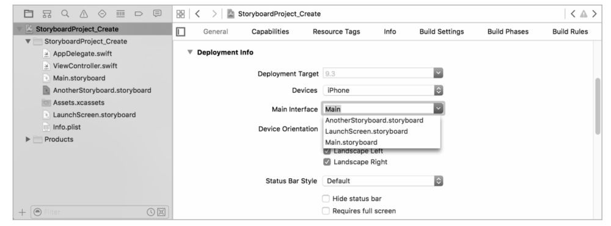

# iOS_Development_From_Entry_To_Master
iOS移动开发从入门到精通 书名：iOS移动开发从入门到精通 作者：李发展　王亮　王金柱 ISBN：9787302462026 本书由清华大学出版社有限公司授权京东阅读电子版制作与发行

目  录                                        
#  第19章  Storyboard故事板的使用 394                          
## 19.1  Storyboard概述 395                                   
### 19.1.1  Storyboard的优缺点 395                             
### 19.1.2  故事板的组织形式 396                               
### 19.1.3  创建一个Storyboard 397              

19.1.3　创建一个Storyboard
使用【Single View Application】模板创建的项目，将自带两个Storyboard文件，一个是Main.storyboard，用于呈现应用程序的主界面。
另一个是LaunchScreen.storyboard文件，用于设计和布局应用程序的启动界面。
如果需要添加更多的Storyboard文件，可以在项目文件夹上点击鼠标右键，弹出右键菜单，然后选择【New File】选项，如图19.4所示。   

图19.4  
接着在弹出的模板选择窗口中，依次点击【User Interface>Storyboard】，如图19.5所示。   

图19.5  
Storyboard创建后，将在左侧的项目导航区出现一个名为 AnotherStoryboard的Storyboard文件，该Storyboard没有包含任何的视图控制器，如图19.6所示。   

图19.6    
由于新建的Storyboard文件内容为空，所以将一个新的视图控制器从右侧的控件库中拖动到中间的故事板区域，如图19.7所示。   

图19.7  
在Storyboard中添加视图控制器后，视图控制器的默认尺寸为Inferred，即由系统来决定其大小。为了方便显示，我们可以将其尺寸设置为iPhone 4-inch，如图19.8所示，在底部的【View As】设置面板，选择【iPhone SE】选项作为故事板中视图控制器的尺寸。   

图19.8  
接着再为视图控制器的根视图设置背景颜色，首先在控制器的视图区域点击，以选择根视图。然后点击【Show the Attributes inspector】按钮，打开属性观察器面板。在属性观察器面板中，点击背景颜色下拉箭
头，打开颜色设置面板。在颜色面板中，选择绿色作为当前视图控制器根视图的背景颜色，如图19.9所示。   

图19.9  

               
### 19.1.4  更改故事板的初始视图控制器 398                
19.1.4　更改故事板的初始视图控制器
在设置完视图控制器之后，需要将该视图控制器作为故事板的初始视图控制器。首先选择当前的视图控制器，然后在右侧的属性观察器面板中，勾选【是否初始视图控制器】复选框，将该视图控制器设置为AnotherStoryboard的初始视图控制器，当程序加载该Storyboard时，将自
动加载当前的视图控制器，如图19.10所示。  

图19.10  
对于一个基于【Single View Application】模板创建的项目来说，项目默认加载的Storyboard是Main.storyboard。通过项目通用信息配置页面，你可以更改项目的Main Interface，如图19.11所示。   

图19.11  
在【Deployment Info】设置区域的【Main Interface】输入框内，默认为Main.storyboard，点击输入框右侧的下拉箭头，显示项目中的Storyboard列表。   
  
图19.12  
在弹出的Storyboard列表中，选择【AnotherStoryboard.storyboard】选项，更改项目的Main Interface。然后点击Xcode界面左上角的【编译并运行】按钮，打开模拟器预览项目。项目运行后，将弹出一个绿色背影的模拟器，如图19.12所示。     
## 19.2  在Storyboard中使用标准控件 400             

使用Storyboard，我们可以通过拖曳的方式，轻松、快捷地往界面中添加控件，就像在玩积木游戏一样。
本节将讲解如何往Storyboard的视图控制器中，添加UIImageView、UIButton和UILable对象。当用户点击按钮时，将替换UIImageView对象中的图片，同时使用UILable对象显示图片的名称。
首先创建一个基于【Single View Applicaiton】模板的项目，然后在左侧的项目导航区，打开Main.storyboard文件，如图19.13所示。   
  
图19.13  
### 19.2.1　添加三个控件
接着在右侧的控件库中，将Image View控件拖动到当前的视图控制器中，如图19.14所示。   
  
图19.14  
如果对Image View控件的位置不太满意，可以直接拖动该控件至合适的位置。通过控件周围定界框上的锚点，可以调整控件的尺寸，如图19.15所示。   
  
图19.15  
接着使用相同的方式，在控件库中依次将Label和Button控件，拖动到当前的视图控制器中，并放置在Image View控件的下方，最终的效果如图19.16所示。   
  
图19.16  
现在对Label控件的外观进行一下调整，在属性观察器面板中，依次对Label控件的标题、字体颜色、字体大小、居中方式和背景颜色进行修改，如图19.17所示。   
  
图19.17  
然后点击右侧的滚动条查看下方的属性，并设置Label控件的背景颜色。完成Label控件的外观修改后，使用相同的方式，修改Button控件的外观属性，最终的效果如图19.18所示。   
  
图19.18  
接着选择Image View控件，给该控件设置默认显示的图片，如图19.19所示。   
  
图19.19  
在故事板的空白处双击鼠标，可以在50％和100％的显示比例中进行切换，也可以在故事板中点击鼠标右键，弹出显示比例列表，如图19.20所示。   
  
图19.20  
在显示比例列表中选择【缩放到50％】，缩小Storyboard的显示比例，如图19.21所示。   
  
图19.21  
### 19.2.2　对控件进行连接
现在已经完成了界面的设计，接下来需要将Storyboard中的Image View控件和Label控件与视图控制器类文件中的属性进行连接，还需要将Storyboard中的Button控件与视图控制器类文件中的方法进行连接。
这样当用户点击按钮时，将对Image View和Label控件进行修改。在连接控件之前，首先选择一个待连接的控件，这里选择Image View对象。
选择待连接的Image View控件后，点击顶部的【Show the Assistant editor】图标，在Storyboard的右侧显示辅助编辑器，辅助编辑器打开了Storyboard中视图控制器对应的类文件，如图19.22所示。   
  
图19.22  
然后在Image View控件上按下鼠标右键，并拖动鼠标至右侧的代码文件中，或者在按下Control键的同时，在Image View控件上按下鼠标左键，并拖动至右侧的代码文件中，然后松开鼠标，此时会自动打开连接设置窗口，如图19.23所示。   
  
图19.23  
在弹出的连接设置窗口中的【Name】输入框内，输入imageView，作为Image View控件在类文件中对应的属性名称。然后点击连接按钮，完成连接的操作。连接完成后，将在ViewController.swift文件中，增加一个名为imageView的属性，该属性的类型为UIImageView。左侧的@IBOutlet标记，说明该属性是来自Storyboard控件的连接属性：
1 @IBOutlet var imageView：UIImageView！
使用相同的方式，将Label标签控件，也和视图控制器的类文件中的属性进行连接。最后将Button按钮控件也和类文件进行连接，只是在弹出的连接设置窗口中，操作有些不同，如图19.24所示。首先点击【Connection】下拉箭头，弹出连接类型列表，然后选择列表中的【Action】选项，设置连接的类型为Action动作类型。接着在【Name】输入框内，输入动作的名称。   
  
图19.24  
完成连接设置之后，保持其他选项的默认设置，然后点击【Connect】按钮，结束连接的配置，并在代码文件中创建一个名为nextPicture的方法，方法名称左侧的@IBAction标记，表示该方法是来自Storyboard的连接方法。
1 @IBAction func nextPicture(_ sender：AnyObject) {
2 }
接着为ViewController类文件添加一个名为currentImageNum的整型变量，用来标识当前正在显示的图片的序号，并设置该属性的默认值为1。接着对nextPicture方法进行修改，完成该方法的点击事件，最终的代码如下所示。
1 import UIKit
2
3 class ViewController：UIViewController {
4 var currentImageNum = 1
5 @IBOutlet var picName：UILabel！
6 @IBOutlet var imageView：UIImageView！
7 @IBAction func nextPicture(sender：AnyObject) {
8 currentImageNum += 1
9 let pciture = “Pic\(currentImageNum)”
10 imageView.image = UIImage(named：pciture)
11 picName.text = pciture
12 }
13 override func viewDidLoad() {
14 super.viewDidLoad()
15 // Do any additional setup after loading the view,
typically from a nib.
16 }
17 }
在第8～11行的代码中，实现了按钮的点击事件，当用户点击按钮时，currentImageNum变量值递增1，然后根据currentImageNum变量的值，获得下一张图片的名称，并将该图片加载到内存后，赋予imageView对象的image属性，从而更改Image View视图的图像内容。接着修改picName标签对象的text属性，更改标签对象的显示内容为新图片的名称。
现在已经完成了所有的编码操作，从代码中可以看出，使用Storyboard大大减少了代码的数量。点击【编译并运行】按钮，打开模拟器预览项目，结果如图19.25所示。
在打开的模拟器中，点击【Next】按钮，显示下一张图片，并在标签视图中显示下一张图片的名称，如图19.26所示。继续点击【Next】按钮，再次显示下一张图片，如图19.27所示。   
  
图19.25   
  
图19.26   
  
图19.27  

                             
## 19.3  在Storyboard中使用表格控件 405                       
### 19.3.1  在故事板中添加Table View 405                       
### 19.3.2  添加Table View Cell 405                            
### 19.3.3  设置Table View的数据源 407                         
### 19.3.4  修改ViewController.swift文件 408                   
## 19.4  在Storyboard中使用集合控件 409                       
### 19.4.1  添加Collection View 409                            
### 19.4.2  设置Collection View Cell 409                       
### 19.4.3  设置Collection View的数据源和代理 411              
### 19.4.4  修改ViewController.swift文件 412                   
## 19.5  Storyboard常见的层次结构 413                         
## 19.6  Storyboard之间的页面跳转和参数传递 417               
### 19.6.1  单个Storyboard中页面间的参数传递 417               
### 19.6.2  多个Storyboard中的页面跳转及参数传递 420           
## 19.7  使用约束功能适配多分辨率 424                         
### 19.7.1  打开并运行示例项目 424                             
### 19.7.2  给父视图MainView添加约束 426                       
### 19.7.3  给三个分隔线添加约束 428                           
### 19.7.4  给两个小箭头添加约束 429                           
### 19.7.5  给添加新会员按钮添加约束 431                       
### 19.7.6  给无数据图标添加约束 432                           
## 19.8  小结 433                                             